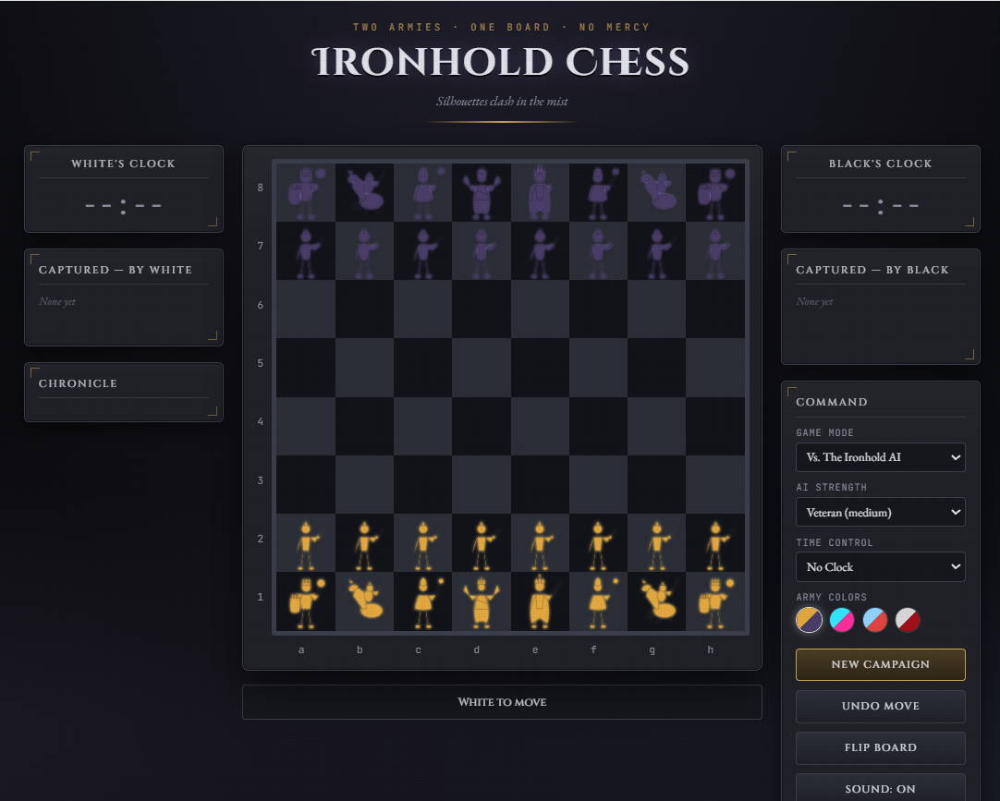
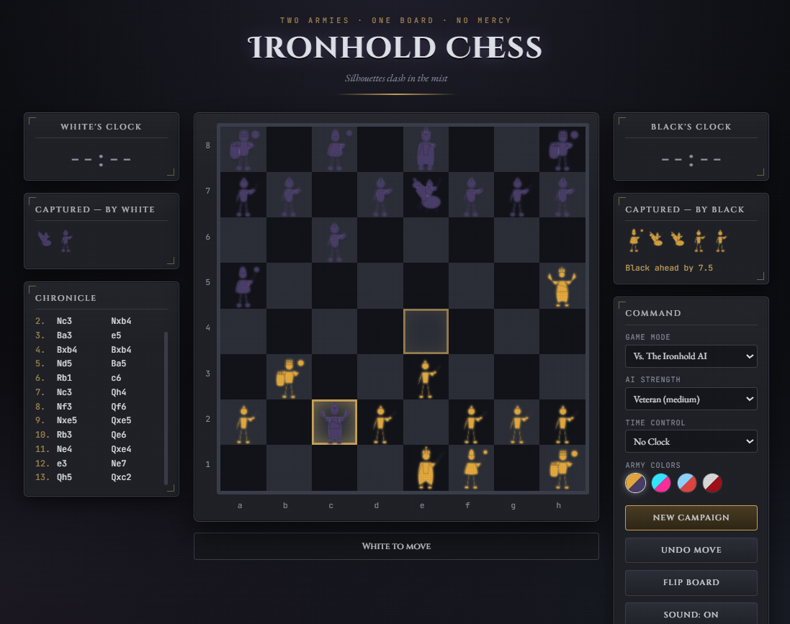

# ⚔️ Ironhold Chess

> **Two Armies · One Board · No Mercy**

**Ironhold Chess** is an original browser-based chess experience that turns traditional chess captures into animated battlefield encounters.

Instead of using conventional chess piece images, every piece is represented by a custom-built, fully articulated SVG warrior — with its own head, torso, arms, legs, and weapon. When a capture occurs, the attacking piece charges in, winds up, and strikes; the defending piece reacts, staggers, and collapses; the board flashes and shakes; and smoke rises from the battlefield.

This is chess — presented as warfare.



---

## 🎮 Play

**[Play Ironhold Chess](https://adithyanhp.github.io/Ironhold-Chess/)**

No installation required — open it in a modern browser and start playing.

---

## 🆕 What's New

This release adds three major systems on top of the original battle-chess experience:

- ⏱️ **Chess clocks** — No Clock, 5-minute, or 10-minute timed games, with a visually emphasized active clock and a proper "Time Out" result.
- 🏆 **A real game-over screen** — checkmate, stalemate, draw, and time-out now end the game with a chess.com-style result card instead of a small status line.
- 🧩 **Puzzle mode** — five hand-verified tactical puzzles (mates and forks) with hints, and chess.com-style move feedback: a correct move flashes green, a wrong move visibly lands, bounces back with a shake, and buzzes — instead of silently refusing the move.

See the [Features](#-features) section below for the full list.

---

## ⚔️ What Makes Ironhold Chess Different?

Most chess games treat a capture as a piece quietly disappearing from the board.

Ironhold Chess treats a capture as a battle.

```text
Normal Chess:                  Ironhold Chess:

♙ × ♟                          ⚔️
Piece captured.                The attacker winds up and charges.
                                The defender reacts.
                                Impact strikes.
                                Smoke rises.
                                The battlefield shakes.
                                The piece falls.
```



The game combines a traditional, fully-legal chess engine with a custom visual combat system built entirely in the browser — no game engine, no external assets, no build step.

---

## ✨ Features

### ♟️ Complete Chess Rules

- Legal move generation for every piece
- Check, checkmate, and stalemate detection
- Castling (kingside and queenside)
- En passant
- Pawn promotion with a piece-choice prompt
- Full move notation and turn management

Every move is validated before it's executed, including protection against moves that would leave your own king in check.

### 🏆 Game-Over Result Screen

Checkmate, stalemate, draw, and time-out all end the game with a dedicated result card — icon, title, and outcome — with **New Campaign** and **Close** actions, instead of a small inline status message.

### ⏱️ Chess Clocks

Play untimed, or set a **5-minute** or **10-minute** clock per side from the Command panel. The active player's clock is visually highlighted and turns red under 30 seconds. Running out of time ends the game immediately with a "Time Out" result.

### 🧩 Puzzle Mode

Five tactical puzzles — verified move-by-move against the game's own legality and checkmate-detection engine, not just eyeballed:

| Puzzle            | Type          |
| ----------------- | ------------- |
| Back-Rank Break   | Mate in 1     |
| The Guarded Queen | Mate in 1     |
| Royal Fork        | Win the queen |
| Diagonal Strike   | Mate in 1     |
| The Two-Move Trap | Mate in 2     |

You can move **any** of your pieces to explore the position — only the correct solution move is accepted. A correct move flashes the destination square green; an incorrect one visibly lands, then bounces back with a shake and a buzzer, just like chess.com's puzzle trainer. A 💡 **Hint** button highlights the right piece to move without giving away the destination.

### 🤖 Play Against the Ironhold AI

Two game modes — **Two Players** locally, or **Vs. The Ironhold AI** — with three AI strengths:

| Level   | Difficulty |
| ------- | ---------- |
| Recruit | Easy       |
| Veteran | Medium     |
| Warlord | Hard       |

The AI uses minimax search with alpha-beta pruning, evaluating material value, central control, and board position to select its move.

### ⚔️ Animated Battle Captures

Every capture plays out as a short, choreographed fight: wind-up, step-in, weapon strike, impact reaction, and collapse — synced with a screen flash, board shake, smoke particles, and a procedurally generated clash sound.

### 🛡️ Custom Articulated SVG Warriors

Every piece is an original design, drawn and rigged entirely in SVG — not a recolored chess font or icon set. Each has its own head, torso, arms, legs, and weapon, so limbs can animate independently instead of the whole piece moving as one block.

| Piece  | Battlefield Identity                                                    |
| ------ | ----------------------------------------------------------------------- |
| Pawn   | Infantry soldier — short sword                                          |
| Knight | Mounted rider — rearing warhorse and blade                              |
| Bishop | Hooded mystic — dark energy staff, flowing gothic hood                  |
| Rook   | Armored guardian — crenellated tower helm, battlement shield, pauldrons |
| Queen  | Regal duelist — flowing gown, train, curved twin blades                 |
| King   | Crowned warlord — greatsword, orb-finial crown                          |

### 🎭 Piece-Specific Combat Animation

Different piece types swing, thrust, or spin differently — a sword swing reads differently from a staff thrust or the queen's dual-blade spin — with the torso, head, and legs all animating in support of the strike.

### 🎨 Four Visual Army Palettes

Switch the whole board's color identity live, with no reload:

- 🔥 **Molten Gold** — Gold vs. Deep Obsidian
- 🌈 **Neon** — Neon Cyan vs. Neon Pink
- ❄️ **Ice** — Ice Blue vs. Fire Red
- 💀 **Blood Moon** — Bone White vs. Blood Red

### 📜 Battle Chronicle

A scrolling move log with full algebraic notation, including check and checkmate marks.

### ☠️ Captured Pieces & Material Count

Both armies' captured pieces are tracked separately, alongside a running material advantage indicator.

### 🗺️ Labeled Board

Full file (a–h) and rank (1–8) labels along the board edges, and the last-moved squares are highlighted so you can always see what just happened.

### ↩️ Undo, 🔄 Flip Board, and 🔊 Sound Toggle

Undo a move (including the AI's reply when playing against it), flip the board to view from either side, and toggle procedural sound effects on or off.

---

## 🕹️ How to Play

1. **Choose a game mode** — Two Players, Vs. the Ironhold AI, or Puzzles.
2. **If playing the AI**, pick a strength: Recruit, Veteran, or Warlord.
3. **If you want a timed game**, pick a Time Control: No Clock, 5 Minutes, or 10 Minutes.
4. **Pick an army palette** — Gold, Neon, Ice, or Blood.
5. **Click a piece** to see its legal destinations highlighted on the board.
6. **Click a highlighted square** to move. If it's a capture, the battle plays out automatically.

## 🎮 Controls

| Action              | Control              |
| ------------------- | -------------------- |
| Select a piece      | Click                |
| Move a piece        | Click a legal square |
| Promote a pawn      | Choose a champion    |
| Start a new game    | New Campaign         |
| Undo a move         | Undo Move            |
| Rotate the board    | Flip Board           |
| Toggle sound        | Sound: On / Off      |
| Change visual theme | Army Colors          |
| Set a time control  | Time Control         |
| Get a puzzle hint   | 💡 Hint               |

---

## 🛠️ Technology

Built with plain web technologies — no framework, no build system, no dependencies.

- **Core:** HTML5, CSS3, JavaScript, SVG, CSS animations
- **Audio:** Web Audio API (procedurally generated, no audio files)
- **AI:** Minimax with alpha-beta pruning, material + positional evaluation
- **Rendering:** Persistent, diff-based DOM updates, programmatically generated SVG figures, temporary battle overlays for capture sequences

---

## 📁 Project Structure

```text
Ironhold-Chess/
├── index.html
├── README.md
├── LICENSE
└── assets/
    └── screenshots/
        ├── gameplay.png
        └── battle.png
```

The game itself is intentionally self-contained in a single `index.html` — UI, styling, SVG artwork, chess engine, AI, puzzles, clocks, animation system, and audio all live in one file.

---

## 🚀 Run Locally

```bash
git clone https://github.com/adithyanhp/Ironhold-Chess.git
cd Ironhold-Chess
```

Then just open `index.html` in a modern browser. No package installation, build process, or backend server required.

---

## 🌐 Browser Support

Works in any modern browser with ES6, SVG, CSS animation, and Web Audio API support — Chrome, Edge, Firefox, and Safari are all recommended.

## 🪟 Install as an App

Ironhold Chess can run in its own window via your browser's install feature. On Windows 11: open the game in a supported browser → open the browser menu → "Install this site as an app."

---

## 🗺️ Roadmap

- [ ] Custom battle arenas (Frozen Wastes, Bloodmoon Battlefield, Neon Ruins, Ancient Temple)
- [ ] More unique per-piece combat animations
- [ ] More puzzle categories (pin, discovered attack, endgame puzzles) and a puzzle streak counter
- [ ] Achievement system (persisted via localStorage)
- [ ] Campaign mode with mission-based win conditions
- [ ] AI personalities (Aggressor, Defender, Strategist, Berserker)
- [ ] Clock increments (5+3, 10+5, etc.)
- [ ] Draw offers and resignation
- [ ] More army themes and warrior designs
- [ ] Online multiplayer

---

## 🎯 Vision

> **What if a chess capture felt like a battle?**

Ironhold Chess combines the strategic depth of chess with the visual language of a battlefield — the goal isn't to replace chess, it's to make every move feel more alive.

---

## 🤝 Contributing

Bug reports, gameplay ideas, new battle animations, warrior concepts, and pull requests are all welcome.

## 📄 License

Licensed under the **GPL-2.0 License**. See [`LICENSE`](LICENSE) for details.

## 👨‍💻 Author

**Adithyan H P**

---

**⚔️ Enter the battlefield. Make your move. ⚔️**
